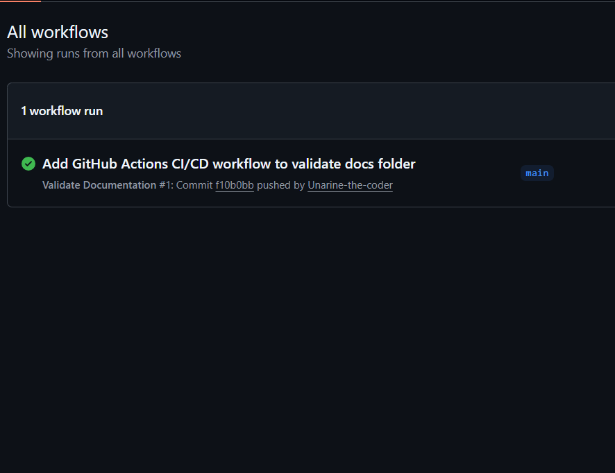

# RaceDay – Event Management System

## System Description

**RaceDay** is a full-stack web-based event management system designed specifically for the South African road running, walking, and cycling community. The platform allows **Event Organisers** to create and manage events, categories, and participant results, while **Participants** can browse upcoming events, enter events, track their personal performance history, and prepare for race day.

This repository contains **Part 1** of the Portfolio of Evidence (POE) for PROG6212 – Programming 2B. In this phase, we have planned the entire system by producing an **Entity Relationship Diagram (ERD)**, a full **API endpoint plan**, and a **SQL database script**.

> **Note:** No application code (API or MVC) has been written yet. This is purely the planning and database design phase.

---

## Roles

The system supports two distinct user roles, with role-based access enforced at the API level (to be implemented in Part 2).

| Role | Permissions |
| :--- | :--- |
| **Organiser** | - Create, edit, and delete events. - Manage event categories (add, update, remove). - Capture participant results (finish times and positions). - View all enrolments for their events. |
| **Participant** | - Create an account and manage profile. - Browse events and view event details. - Enrol in events by selecting a category. - View own enrolment history and personal results. |

---

## Setup Instructions (For Markers)

To test the database design, follow these steps:

1. **Open SQL Server Management Studio (SSMS)** and connect to your SQL Server instance.
2. **Open** the file `/docs/RaceDay-Schema.sql` from this repository.
3. **Execute** the entire script (press `F5` or click `Execute`).
4. The script will:
   - Create a database called `RaceDayDB`.
   - Create all tables (`User`, `Role`, `Event`, `Category`, `EventCategory`, `Enrolment`, `Result`).
   - Define all primary keys, foreign keys, and constraints.
   - Seed the database with realistic sample data (2 Organisers, 2 Participants, 3 Events, categories, enrolments, and results).
5. To verify the data, run `SELECT * FROM [User];` or any other table to see the inserted records.

**Expected Result:** The script runs without errors on a clean SQL Server instance.

---

## CI/CD Status

GitHub Actions is configured to validate the repository structure for Part 1. The workflow checks that the `/docs` folder exists and contains all required files (`ERD.png`, `Endpoint-Plan.md`, `RaceDay-Schema.sql`).

✅ **Current Build Status:**

A screenshot of the successful green build is also available in the `/docs` folder (or will be attached in a future commit).

---

## Video Presentation

An unlisted YouTube video walkthrough for Part 1 is available here:

🔗 **[Click here to watch the video](https://www.youtube.com/watch?v=YOUR_VIDEO_ID)**  
*(Replace the link above with your actual YouTube video URL after uploading.)*

The video covers:
- The ERD design decisions and entity relationships.
- The full API endpoint plan and why specific endpoints were chosen.
- A live run of the SQL script in SSMS.

---

## Repository Structure
PROG6212-RaceDay-POE-Part1/
├── docs/
│ ├── ERD.png # Entity Relationship Diagram
│ ├── Endpoint-Plan.md # Complete API endpoint specification table
│ └── RaceDay-Schema.sql # SQL script to create and seed the database
├── .github/
│ └── workflows/
│ └── validate-docs.yml # GitHub Actions CI/CD workflow
├── README.md # This file
└── .gitignore # Visual Studio Git ignore file

text

---

## Part 1 Deliverables Checklist

- [x] ERD diagram (minimum 6 entities) – saved as `/docs/ERD.png`
- [x] API Endpoint Plan with 6 columns and failure codes – saved as `/docs/Endpoint-Plan.md`
- [x] SQL Database Script with CREATE TABLE, constraints, and seed data – saved as `/docs/RaceDay-Schema.sql`
- [x] README with system description, roles, setup, CI/CD badge, and video link
- [x] GitHub Actions workflow validating the `/docs` folder
- [x] Minimum 20 meaningful commits to GitHub

---

## Next Steps

- **Part 2:** Build the RESTful API in C# connecting to this database.
- **Part 3:** Build the MVC web application, integrate Azure Blob Storage, and containerise with Docker.